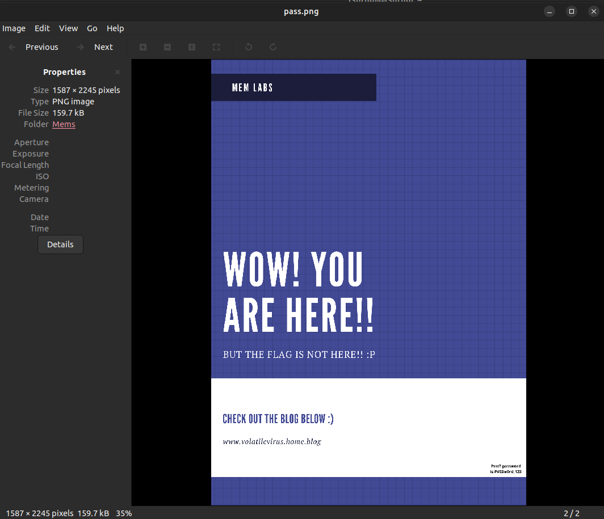
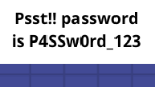
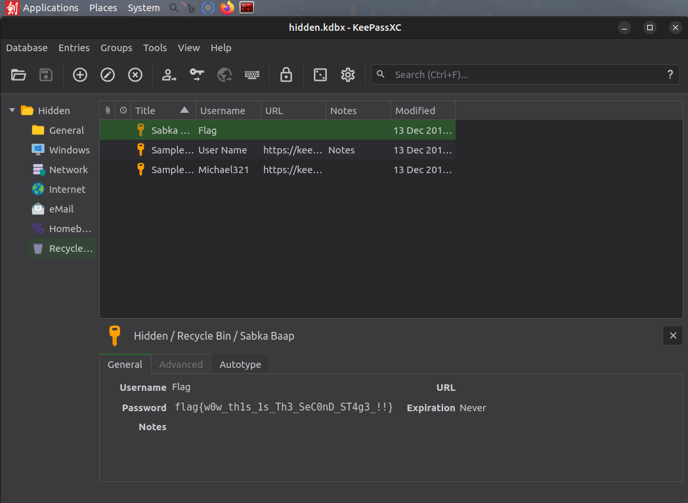
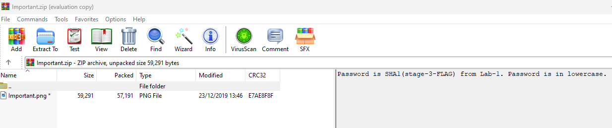

# MemLabs Solutions via volatility3 | VERY HARD WAY :( |

This is solutions of famous memory forensics challenge [MemLabs](https://github.com/stuxnet999/MemLabs).


## MemLabs Lab 1

#### Use the following commands to acquire 1st flag

```bash
# List all running processes on commandline
volatility3 -f MemoryDump_Lab1.raw windows.cmdline
# Dump cmd.exe
volatility3 -f MemoryDump_Lab1.raw -o dumpo/ windows.memmap --pid 1984 --dump
# strings the dump and try to grep all echos
strings pid.1984.dmp | grep -i "echo"
```
Flag encoded: ZmxhZ3t0aDFzXzFzX3RoM18xc3Rfc3Q0ZzMhIX0=

Flag: flag{th1s_1s_th3_1st_st4g3!!}

#### Use the following commands to acquire 2nd flag

```bash
# Find PID of mspaint
volatility3 -f MemoryDump_Lab1.raw windows.pslist
# Dump run process to a file
volatility3 -f MemoryDump_Lab1.raw -o dumpo/ windows.memmap --pid 2424 --dump
# Change extension of file
mv pid.2424.dmp 2424.data
# Open 2424.data file on GIMP
gimp 2424.data
```
###### Adjust width and height of image for reveal 2nd flag


#### Use the following commands to acquire 3rd flag

```bash
# List files that loaded to RAM. We only need Alissa's files
volatility3 -f MemoryDump_Lab1.raw windows.filescan | grep "Alissa Simpson"
# Dump important.rar file
volatility3 -f MemoryDump_Lab1.raw -o dumpo/ windows.dumpfiles --physaddr 0x3b48bc0
# Find password of rar file by uppercase of hash of Alissa's password
volatility3 -f MemoryDump_Lab1.raw windows.hashdump
# Unrar file
unar important.rar (Password required!)
```
###### flag3.png will be dropped


## MemLabs Lab 2

#### Use the following commands to acquire 1st flag

```bash
# List all process envars
volatility3 -f MemoryDump_Lab2.raw windows.envars
```
Flag_encoded = ZmxhZ3t3M2xjMG0zX1QwXyRUNGczXyFfT2ZfTDRCXzJ9

Flag = flag{w3lc0m3_T0_$T4g3_!_Of_L4B_2})

#### Use the following commands to acquire 2nd flag

```bash
# Find location of hidden.kdbx and Password.png
volatility3 -f MemoryDump_Lab2.raw windows.filescan
# Dump process to a file
volatility3 -f MemoryDump_Lab2.raw -o dumpo/ windows.dumpfiles --physaddr 0x3fb112a0
# Dump Password.png to a file
volatility3 -f MemoryDump_Lab1.raw -o dumpo/ windows.dumpfiles --physaddr 0x3fce1c70
# Change extension of file
mv dumphidden/LONG_DUMP_FILE_NAME dumphidden/Hidden.kdbx
# Open Hidden.kdbx file on KeePassXC
sudo apt update
sudo apt install keepassxc
keepassxc
```
###### Extract Password from Password.png with zooming in right-down corner


###### Find flag location from saved passwords in DB


#### Use the following commands to acquire 3rd flag

```bash
# Dump Google Chrome history
volatility3 -f MemoryDump_Lab2.raw -o dumpo/ windows.dumpfiles --physaddr 0x3fcfb1d0
strings file.0x3fcfb1d0.0xfa8000efd1d0.DataSectionObject.History.dat
# There is a interesting link to mega.nz folder
https://mega.nz/folder/TrgSQQTS#H0ZrUzF0B-ZKNM3y9E76lg
```
###### Download and open file

###### Insert Password (Found it from hint in zip file that is SHA1 of flag3_Lab1(flag{w3ll_3rd_stage_was_easy}) = 6045dd90029719a039fd2d2ebcca718439dd100a)


## MemLabs Lab 3

#### Use the following commands to acquire 1st part of the flag
##### A malicious script encrypted a very secret piece of information. So, both of the encryptor and encrypted files must be loaded to the RAM.
```bash
# Time to run filescan for cached files
volatility3 -f MemoryDump_Lab3.raw windows.filescan
# After a few greps we can find cached evilscript.py. Dump it
volatility3 -f MemoryDump_Lab3.raw -o dumpo/ windows.dumpfiles --physaddr 0x3de1b5f0
# Read the code
cat dumpo/evil.py
```

Here is the python code:
```python
import sys
import string

def xor(s):

        a = ''.join(chr(ord(i)^3) for i in s)
        return a


def encoder(x):

        return x.encode("base64")


if __name__ == "__main__":

        f = open("C:\\Users\\hello\\Desktop\\vip.txt", "w")

        arr = sys.argv[1]

        arr = encoder(xor(arr))

        f.write(arr)

        f.close()
```

It is encrypting file called "vip.txt". Dump it from cache
```bash
# Dumping vip.txt
volatility3 -f MemoryDump_Lab3.raw -o dumpo/ windows.dumpfiles --physaddr 0x3e727e50
# Read file content
cat vip.txt
```
After reading python code we can eaisly decrypt the content of the vip.txt
```python
import base64

def reverse_xor(s):
    return ''.join(chr(ord(i) ^ 3) for i in s)

# Encoded string
encoded = "am1gd2V4M20wXGs3b2U="

# Step 1: Decode from Base64
decoded = base64.b64decode(encoded).decode()

# Step 2: Reverse the XOR operation
original = reverse_xor(decoded)
original
```
Flag = inctf{0n3_h4lf

#### Use the following commands to acquire 2nd part of the flag
##### You will need this steghide to solve the challenge. Steghide is a stenography tool, which used for hide some data in other form of the data mostly text in images. Search for image files and after a few greps we found suspision1.jpeg. Dump it
```bash
volatility3 -f MemoryDump_Lab3.raw -o dumpo/ windows.dumpfiles --physaddr 0x4f34148
```

Check image:

##### Hmm, there is some some noise along the diagonal of the image which is common case in stenography. But it is not a case with the real one, which I found online by image code under the dumped one.

##### Maybe, some data is hidden there :D. Let's check
```bash
steghide extract -sf dumpo/suspision1.jpeg
```
##### It will ask for a passphrase. It is 1st flag, we found. Steghide will output file named "secret text". Let's check it
```bash
cat secret\ text

_1s_n0t_3n0ugh}
```
Flag = _1s_n0t_3n0ugh}

#### Complete flag of MemLabs Lab 3
#### Flag = flag1 + flag2 = inctf{0n3_h4lf_1s_n0t_3n0ugh}


## Contributing

Pull requests are welcome. For major changes, please open an issue first
to discuss what you would like to change.

Please make sure to update tests as appropriate.

## License

[MIT](https://choosealicense.com/licenses/mit/)
