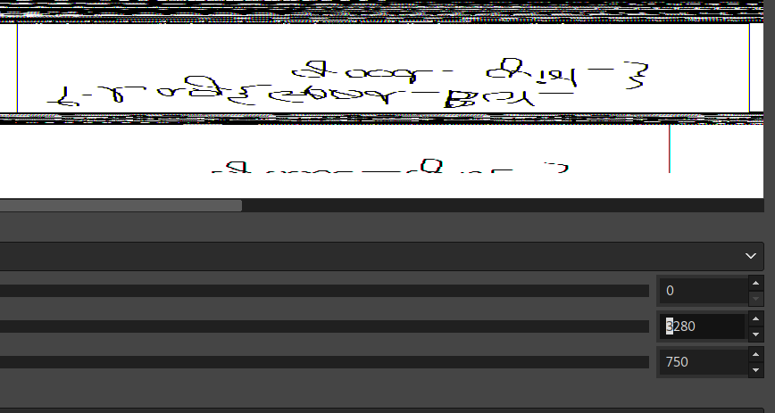
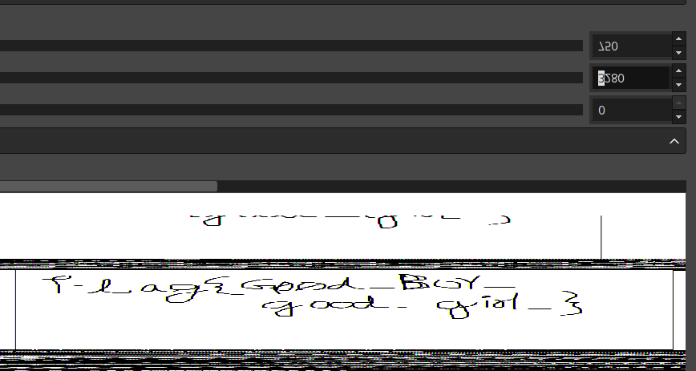
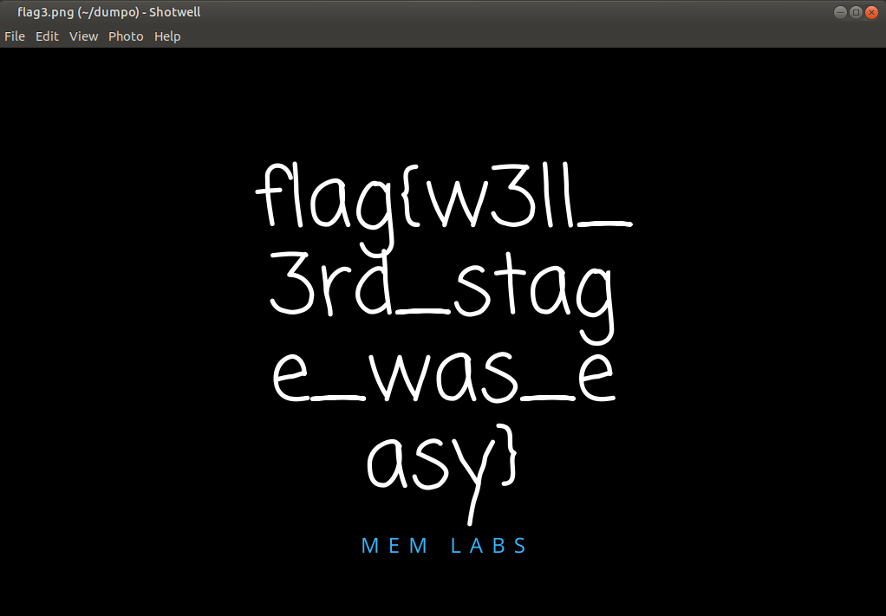

# MemLabs Solutions via volatility3 | VERY HARD WAY :( |

This is solutions of famous memory forensics challenge [MemLabs](https://github.com/stuxnet999/MemLabs).


## MemLabs Lab 1

#### Use the following commands to acquire 1st flag

```bash
# List all running processes on commandline
volatility3 -f MemoryDump_Lab1.raw windows.cmdline
# Dump cmd.exe
volatility3 -f MemoryDump_Lab1.raw -o dumpo/ windows.memmap --pid 1984 --dump
# strings the dump and try to grep all echos
strings pid.1984.dmp | grep -i "echo"
```
Flag encoded: ZmxhZ3t0aDFzXzFzX3RoM18xc3Rfc3Q0ZzMhIX0=

Flag: flag{th1s_1s_th3_1st_st4g3!!}

#### Use the following commands to acquire 2nd flag

```bash
# Find PID of mspaint
volatility3 -f MemoryDump_Lab1.raw windows.pslist
# Dump run process to a file
volatility3 -f MemoryDump_Lab1.raw -o dumpo/ windows.memmap --pid 2424 --dump
# Change extension of file
mv pid.2424.dmp 2424.data
# Open 2424.data file on GIMP
gimp 2424.data
```
###### Adjust width and height of image for reveal 2nd flag



#### Use the following commands to acquire 3rd flag

```bash
# List files that loaded to RAM. We only need Alissa's files
volatility3 -f MemoryDump_Lab1.raw windows.filescan | grep "Alissa Simpson"
# Dump important.rar file
volatility3 -f MemoryDump_Lab1.raw -o dumpo/ windows.dumpfiles -Q 0x3b48bc0
# Find password of rar file by uppercase of hash of Alissa's password
volatility3 -f MemoryDump_Lab1.raw windows.hashdump
# Unrar file
unar important.rar (Password required!)
```
###### flag3.png will be dropped



## Contributing

Pull requests are welcome. For major changes, please open an issue first
to discuss what you would like to change.

Please make sure to update tests as appropriate.

## License

[MIT](https://choosealicense.com/licenses/mit/)
